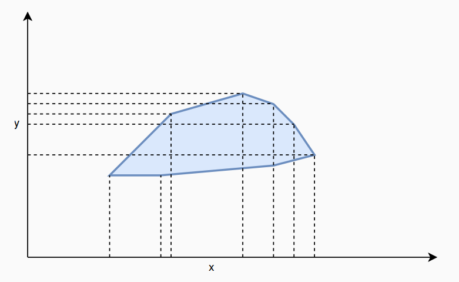
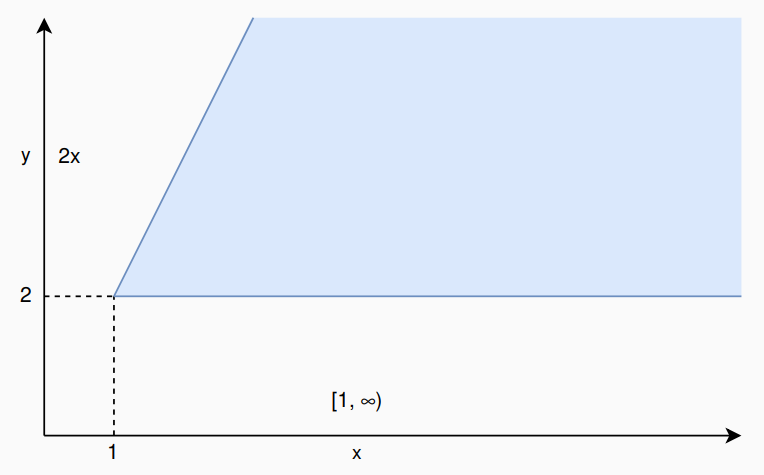
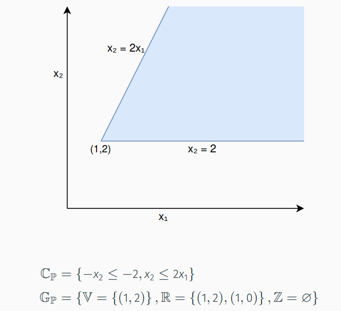
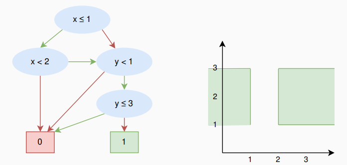

# 1. Понятия анализа и верификации ПО. Классификация методов анализа ПО. Непротиворечивость, полнота и точность анализа. Проблемы анализа ПО: теорема Тьюринга, теорема Райса.

# 2. Основные подходы к статическому анализу ПО. Сигнатурный поиск. Понятие абстрактного синтаксического дерева, другие модели ПО.

# 3. Анализ ПО на основе типов. Связь классических систем типов и анализа ПО. Системы типов как простейший вид анализа ПО. Полнота и точность анализа на основе систем типов. Понятие анализа на основе ограничений, типичная структура такого анализа.

# 4. Способы решения задачи присвоения типов. Задача унификации. Алгоритмы решения задачи унификации. Рекурсивные типы и регулярная унификация.

# 5. Понятие графа потока управления и моделей на его основе. Понятие чувствительности к потоку управления в анализе ПО. Виды потокочувствительных анализов. Абстрактный домен и абстрактное состояние. Потокочувствительный анализ знаков.

# 6. Введение в теорию решёток. Понятие частично упорядоченного множества. Верхние и нижние грани. Примеры решёток, применимых в анализе ПО. Анализ знака на основе теории решёток.

# 7. Теорема о наименьшей неподвижной точке. Понятие монотонного фреймворка. Алгоритмы поиска неподвижной точки. May- и must- анализ.

# 8. Анализ живости. Анализ готовых выражений.

# 9. Анализ занятости. Анализ достижимых значений. Распространение констант.

# 10. Интервальный анализ. Тривиальная интервальная решётка. Проблемы реализации анализов на основе бесконечных решёток. Widening в применении к решёткам и ограничения, связанные с его применением.

# 11. Narrowing в применении к решёткам и ограничения, связанные с его применением. Методы объединения widening и narrowing. Модификации алгоритма решения задачи поиска неподвижной точки с применением widening и narrowing.

# 12. Понятие чувствительности к пути исполнения. Зависимости по данным и по управлению. Предикаты путей. Интервальный анализ, чувствительный к путям исполнения, проблемы, связанные с ним. Выбор множества предикатов путей в общем случае. Метод уточнения абстракции на основе контрпримеров (CEGAR).

# 13. Понятие межпроцедурности в анализе ПО. Пессимистичный межпроцедурный анализ и проблемы, связанные с ним. Полная подстановка тела функции и проблемы, связанные с ней. Понятие полного графа потока управления для программы и анализ на его основе.

# 14. Понятие контекстной чувствительности. Метод ограниченного клонирования процедур, его ограничения и параметризация. Методы улучшения контекстной чувствительности.

# 15. Метод контекстной чувствительности на основе входных данных, его анализ в сравнении с методом ограниченного клонирования процедур. Понятие аппроксимации функции в программе. Проблема внешних функций и варианты её решения.

# 16. Анализ указателей. Анализ псевдонимов. Анализ цели. Анализ формы. Направленный и ненаправленный анализ указателей.

Указателем является ссылка на область памяти (memory cells).

Любой анализ над значениями существенно усложняется с появлением в программе указателей, т.к. любые модификации памяти
не предсказуемы.

Сами указатели являются нежелательными, т.к. подразумевают довольно долгую операцию обращения к памяти. Большинство
компиляторов пытается свести количество указателей к минимуму.

Если в программе присутствуют указатели, используются анализы указателей, которые учитывают набор возможных ячеек
памяти, используемых при выполнении программы.

Как правило, реальные анализы нечувствительны к потоку (задача чувствительности к потоку просто неразрешима).

Анализы можно подразделять на 2 подтипа (было объяснено не очень понятно):

- направленный - подразумевается, что, если указатели A и B указывают на одну ячейку памяти, и указатели A и C указывают
  на одну ячейку памяти, это не значит, что B и C указывают на одну ячейку; короче данный тип анализов использует
  включения множеств;
- ненаправленный - подразумевает, что B и C указывают на одну ячейку; грубо говоря данный тип анализов использует
  сравнение множеств.

Далее приведены возможные формулировки анализа указателей.

## Анализ псевдонимов (Alias analysis)

Анализ псевдонимов выявляет для каждой пары указателей, ссылаются ли они на одну и ту же ячейку памяти.

May-формулировка: выявляет для каждой пары указателей, могут ли они ссылаться на одну и ту же ячейку памяти.

Как альтернатива, есть менее точный анализ множеств псевдонимов (alias set analysis), разбивающий все указатели на
множества, которые могут указывать на одни и те же ячейки.

## Анализ цели

Анализ цели выявляет для каждого указателя, на какую ячейку памяти он ссылается.

May-формулировка: выявляет для каждого указателя, на какие ячейки памяти он может ссылаться.

Данный анализ эквивалентен анализу псевдонимов и может быть построен на его основе (и наоборот, на основе анализа цели
можно построить анализ цели).

## Анализ формы

Анализ формы выявляет структуру области памяти, достижимой по указателям. Данный анализ строит модель в виде графа,
где указывается примерное расположение ячеек памяти.

По сути является аналогом анализа цели с другим описанием, но с более формальным обозначением ячеек.

# 17. Алгоритм Стенсгаарда, его реализация на основе унификации.

Алгоритм реализует нахождения наборов псевдонимов (alias sets) - наборов указателей, ссылающихся на одну и ту же ячейку
памяти. Является ненаправленным анализом (направление присваивания не имеет значения).

Для анализа уравнения строятся следующим образом:

- `X = alloc` - `X` присваивается индексированный указатель на выделенную ячейку памяти; каждая аллокация
  рассматривается как отдельный индекс;
- `X = Y` - присвоение одного указателя другим; `X` и `Y` равны;
- `X = &Y` - `X` является указателем на `Y`;
- `*X = Y` - `X` является указателем на некоторую ячейку памяти, равной `Y`;
- `X = *Y` - `Y` является указателем на некоторую ячейку памяти, равной `X`;

Анализ оперирует именно ячейками памяти, т.к. указатели могут ссылаться друг на друга или самих себя, что не стабильно.

Для решения уравнений используется унифицирующий солвер (как при анализе типов). На выходе получаются равенства,
обозначающие множества псевдономов.

Также, как мы помним по анализу типов, унифицирующий солвер учитывает рекурсию, т.е. может учитывать указатели на самих
себя.

Алгоритм имеет сложность $o(N)$.

Проблемой является то, что алгоритм работает с множествами: он объединяет в одно множество указатели, которые могут
ссылаться на одну и ту же ячейку памяти или указатель; при этом, если указатель из другого множества ссылается на один
из указателей этого множества, то алгоритм посчитает, что он ссылается на каждый указатель этого множества. Это снижает
точность анализа.

# 18. Алгоритм Андерсена, его реализация на основе кубического фреймворка. Контекстно-чувствительный анализ указателей.

## Cubic framework

Cubic framework - солвер для решения уравнений следующего вида:

$$
t_i \in x_j\\
x_m \subseteq x_n\\
t_i \in x_j \rightarrow x_m \subseteq x_n
$$

где $t_1, \dots, t_N$ - набор токенов (элементы или константы), $x_1, \dots, x_K$ - набор переменных, соответствующих
множествам констант.

Задача состоит в поиске множеств, в которых находится определенный элемент.

В нашем случае рассматриваются множества указателей в программе и наборы переменных, для которых определяется, как в
нем расположены элементы.

Солвер использует универсальный алгоритм, имеющий сложность $o(n^3)$, зависящую от количества уравнений (это в худшем
случае, обычно это $~o(n^2))$.

Структура решения представляет собой ориентированный ациклический граф (DAG), в вершинах которого хранится:

- множество токенов;
- отображение из токенов в множества пар переменных.

Каждой переменной $x_i$ соответствует вершина графа.

Каждой дуге соответствует отношение включения (стрелка означает, что одно множество включает в себя другое множество).

Уравнения обрабатываются по одному, структура всегда содержит минимальное решение.

Решение уравнений вида $t_i \in x_j$:

$$
node \leftarrow nodes(x_j)\\
tokens(node) \leftarrow tokens(node) \lor {t_i}\\
if\ node(t_i) \neq []\ then\\
\quad for all {x_k,x_n} \in node(t_i) do\\
\quad \quad add\ edge\ from\ nodes(x_k)\ to\ nodes(x_n)\\
\quad end\ for\\
\quad node(t_i) \leftarrow {}\\
end\ if
$$

Решение уравнений вида $t_i \in x_j \rightarrow x_m \subseteq x_n$:

$$
node \leftarrow nodes(x_j)\\
if\ t_i \in tokens(node)\ then\\
\quad add\ edge\ from\ nodes(x_m)\ to\ nodes(x_n)\\
else\\
\quad node(t_i) \leftarrow node(t_i) \lor {{x_m,x_n}}
end\ if
$$

Если при добавлении дуги в граф получился цикл (что означает равенство множеств):

- Соответствующие вершины сливаются вместе
- Сливаются множества токенов
- Сливаются множества пар для каждого токена

## Алгоритм Андерсена

В отличие от алгоритма Стенсгаарда, алгоритм Андерсена является направленным анализом и не сваливает все в сеты.

Если в алгоритме Стенсгаарде использовалось равенство множеств, то для алгоритма Андерсена используется включение,
что позволяет множествам лишь частично пересекаться.

Для анализа уравнения строятся следующим образом:

- `X = alloc` - индексированный указатель на выделенную ячейку памяти относится к множеству токенов переменной `X`;
  каждая аллокация все еще рассматривается как отдельный индекс;
- `X = Y` - множество токенов `X` включает в себя множество токенов `Y`;
- `X = &Y` - указатель на `Y` относится к множеству токенов `X`;
- `*X = Y` - если указатель на некоторую ячейку памяти, относится к множеству токенов `X`, то к его множеству токенов
  относится множество токенов `Y`;
- `X = *Y` - если указатель на некоторую ячейку памяти, относится к множеству токенов `Y`, то его множество токенов
  относится к множеству токенов `X`;

Алгоритм Андерсена является более точным, но говраздо медленнее алгоритма Стенсгаарда.

# 19. Чувствительный к потоку управления анализ указателей. Анализ указателей на основе типов.

Алгоритмы Стенсгаарда и Андерсена работают на всю кодовую базу целиком, а потому они не могут делать анализ в конкретной
точке программы.

## Монотонный фреймворк

Можно использовать монотонный фреймворк, построив решетку булеан над парами всех ячеек памяти, определяемые наборами
аллокаций (можно сопоставить с дугами в points to задаче). Нужней границей решетки является граф без дуг, верхней -

На практике алгоритм является очень медленным и редко используется.

## Анализ указателей на основе типов (Type-based alias analysis)

Данный анализ основан на том, что в языке с системой типизации 2 указателя на 2 разных типа скорее всего не будут
одинаковыми.

Благодаря этому факту можно анализировать указатели на разные типы отдельно, используя любой из рассмотренных нами ранее
анализов, значительно уменьшая пространство поиска.

В реальных системах анализа строится стек анализов. Если на этапе, соответствующего одному из анализов был получен
точный ответ, что 2 указателя - разные, то анализ останавливается. Если анализ не дал точного ответа, то запускается
следующий по стеку анализ.

# 20. Выпуклые реляционные численные домены. Домен выпуклых многогранников.

Нами на лекциях был рассмотрен интервальный анализ, позволявший для каждой переменной определить набор значений, который 
они могут принимать. Данный анализ не может учитывать отношения между переменными.

Существует реляционные численные домены, которые позволяют анализировать линейные зависимости пар переменных.

## Convex Polyhedra

Convex Polyhedra – домен выпуклых многогранников, где отношения между переменными описываются 2 способами:

- системой линейных равенств или неравенств;
- перечислить все возможные значения переменных:

На основе ограничений составляется N-мерный многогранник, где N – размер множества анализируемых переменных ${x_N}$:

Данный домен учитывает варианты, при которых область допустимых значений может быть бесконечной (Infinity Polyhedra):

Представление в виде уравнений также называют матричным.

Представление в виде вершин также называют генераторным.

Генераторное представление для Infinity Polyhedra:

## Polyhedra Lattice

Элементами решетки является пара ${C_P, G_P}$, где $C_P$ – описание многогранника в виде матрицы, $G_P$ – описание 
многогранника в виде набора точек, лучей и прямых.

Отношение включения согласно геометрическому смыслу:

- Пересечение — геометрическое пересечение
- Объединение — выпуклая оболочка геометрического объединения

- Как и с диапазонами, для каждого оператора свой eval и нужно проводить widening.

## Дуализм представления многогранников

В оригинальной статье про Convex Polyhedra используется 40 операторов. На лекциях были рассмотрены 2 из них: объединение
и пересечение.

В случае с генераторным представлением можно без проблем объединить все множества вершин, дуг и прямых из 2 исходных 
доменов, и получить новый домен (возможно избыточный, но корректный).  

Пересечение из генераторного представления сделать почти невозможно (сложная операция), но зато это легко сделать при
помощи матричного представления путем слияния всех уравнений.

Поэтому составляются многогранники двумя способами: одни операции легко сделать с уравнениями, другие с множеством 
значений.

Трансформация из одной формы представления в другую возможно при помощи алгоритма Черниковой, алгоритмическая сложность 
равна $o(nc^{2^{n+1}})$.

Если у нас есть оба представления – получить хотя бы одно всегда просто.

# 21. Выпуклые реляционные численные домены. Разностные матрицы и октагоны.

## Домен разностных матриц (Hexagonal Domain)

Позволяет приводить ограничения в форме $x - y \leq c$.

Между всеми парами и 0 переменных формируется разреженная матрица имеющихся зависимостей.

Также эту матрицу можно рассматривать как матрицу смежности некоторого графа (граф потенциалов). По сути меняется просто 
отображение: переменные не столбцы и строки матрицы, а узлы графа.

Основные операции над матрицами довольно просты (например отношение меньше/больше выражается просто применение этой 
операции на соответствующие элементы матриц), таким образом на основе этого домена можно без проблем строить решетки.

Главной фишкой является то, что операции над матрицами нереально оптимизированы как программно, так и аппаратно, что 
делает данный анализ очень быстрым.

Единственным минусом является ограниченная форма, в которой нужно представить уравнения.

## Восьмигранники (Octagon Domain)

В отличие от предыдущего домена позволяет выражать ограничения в форме $\pm x \pm y \leq c$, что делает его более 
гибким.

Т.к. теперь рассматриваются одновременно порицательные и положительные значения, матрица увеличивается в 4 раза, но в 
целом это приемлемо. В остальном решение ищется также, как и для гексагонального домена.

# 22. Реляционные численные домены. Невыпуклые домены: общее представление.

Все домены названы в соответствии с тем, как они выглядят на графике. 

## Powerset над выпуклым доменом

Над любым выпуклым доменом можно построить булеан, который будет N-отдельных фигур. Соответственно, когда требуется 
провести любую операцию (например пересечение), будет проводиться операция этих фигур друг с другом.

Редко используется из-за высокой алгоритмической сложности. 

## Домен пончиков (Donut domain)

Строится на основе 2 любых доменов ${A, B}$, где $A$ - основной домен, $B$ - дырка в основном домене (а по сути 
перевернутая черной магией решетка).

Говорят в каких-то задачах она эффективна.

## Домен коробок: Boxes domain

Является булеаном над доменом диапазонов, но вместо хранения интервалов по отдельности, хранится в виде графовой 
структуры - линейных решающих диаграмм (LDD). 

Фишка в том, что существует множество эффективных алгоритмов для LDD.

## Конгруэнция

Элементом домена является конгруэнтное соотношение $a \Equiv b[c]$.

В данном случае $a \in {\forall k \in \W | b + ck}$

$k$ - набор координат.

**Дальше буквально вынос мозга, Беляев сам плохо понимает**

По сути получается набор разбросанных по пространству точек. Для каких-нибудь `for (i in 0..10 step 2)` подходит хорошо.
